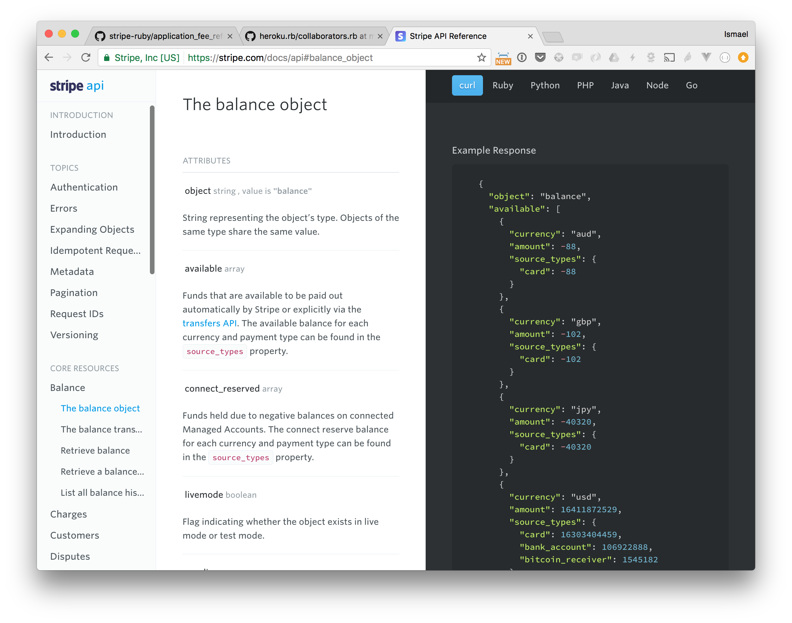
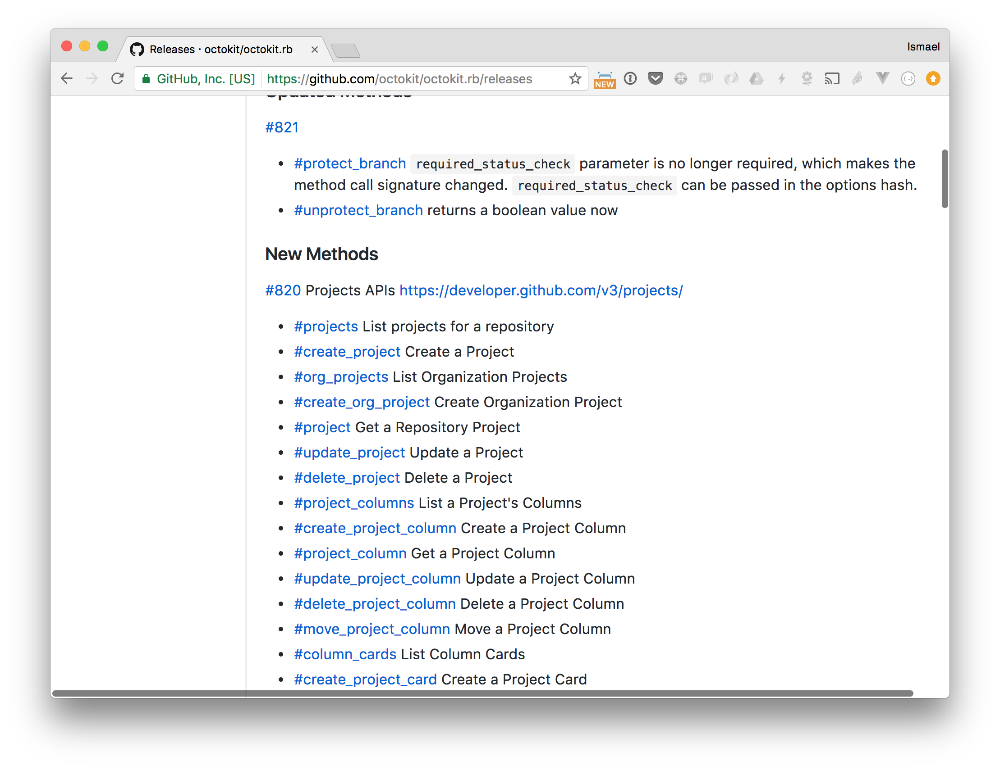
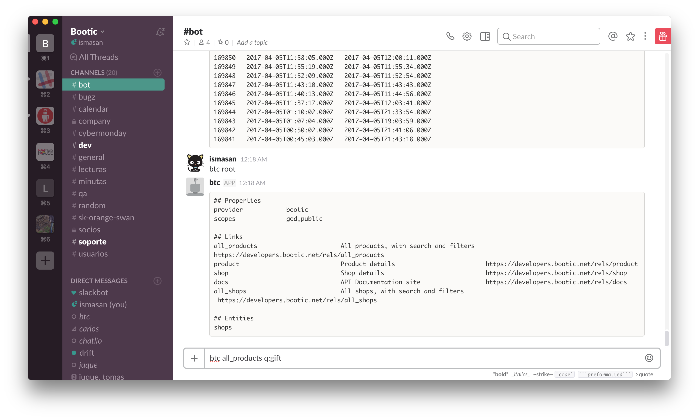
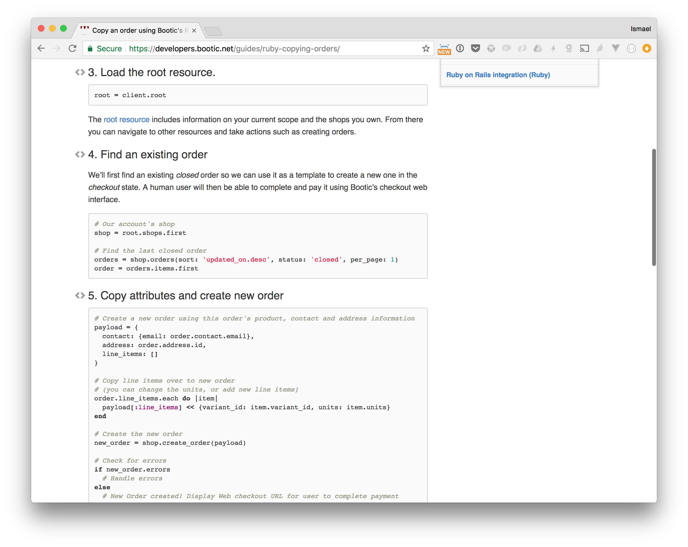
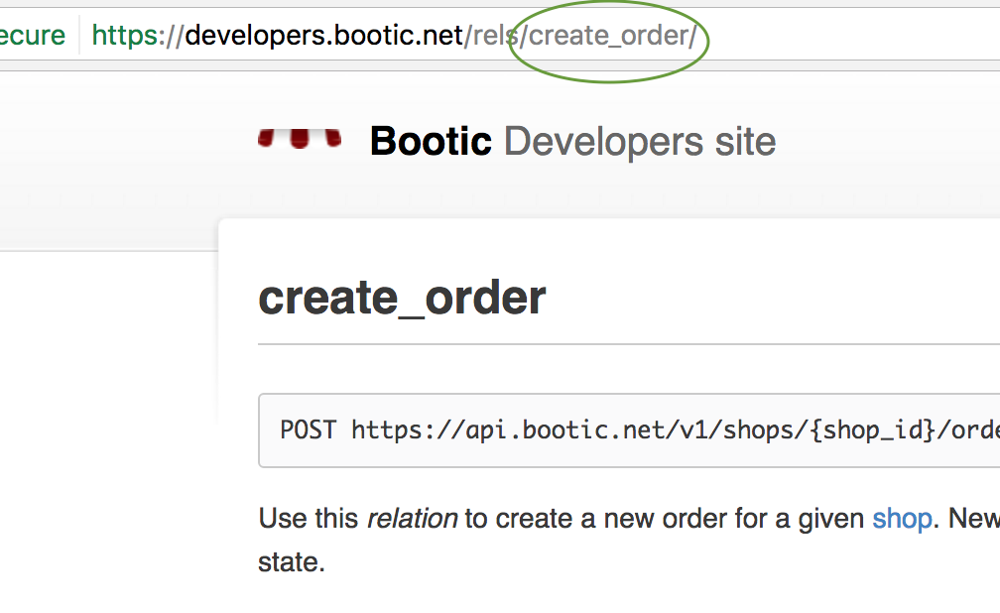

slidenumbers: true

<br />
# Hypermedia APIs
## And Ruby

<br />
<br />

```ruby
# Ismael Celis / @ismasan / thoughtbot London
```

^ * Hypermedia / REST broad subject, theoretical
* I'll focus on one aspect (links) and show concrete examples

---

^ how we write API clients in Ruby
^ regular JSON response

```
GET /orders/:id
```

```json
{
  "updated_at": "2017-04-10T18:30Z",
  "id": 123,
  "status": "open",
  "total": 1000
}
```

---

^ actions on resource

```
PUT /orders/:id/place
```

```json
{
  "updated_at": "2017-04-10T18:40Z",
  "id": 123,
  "status": "placed",
  "total": 1000
}
```

---

^ typical Ruby client
hard-coded URLs

```ruby
order = Client.get("/orders/123")

order = Client.put("/orders/123/place")
```

---

^ slightly better
Still need to release new versions every time

```ruby
order = Client.get_order(123)

order = Client.place_order(123)
```

---

^ Need to read docs to undestand workflow



---

^ play catch up with API



---


---

# Links

^ central to REST APIs.
defines endpoint, request method, is documented.

```html
<a href="/foobar">Foo bar</a>

<link rel="stylesheet" href="/styles.css" />

<form action="/orders/place" method="PUT">
  ...
</form>
```

---

# Links are actions

^ a link defines an operation or state transition

```html
<form action="/orders/place" method="PUT">
  <input type="text" name="discount_code" value="" />
  <select name="shipping">
    <option value="1">Free shipping</option>
    <option value="2">Expensive shipping</option>
  </select>
</form>
```

---

^ I'll focus on links in APIs
and see what we can do in Ruby

### ~~Hypermedia~~
## APIs with links

---

^ without links

```
GET /orders/:id
```

```json
{
  "updated_at": "2017-04-10T18:30Z",
  "id": 123,
  "status": "open",
  "total": 1000
}
```

---

^ with links

```
GET /orders/:id
```

```json
{
  "_links": {
    "place_order": {
      "href": "https://api.com/orders/123/place",
      "method": "put"
    }
  },
  "updated_at": "2017-04-10T18:30Z",
  "id": 123,
  "status": "open",
  "total": 1000
}
```

---

# The client

---

^ an entity wraps an entire JSON response
^ and provides accessors for properties, links
^ and embedded entities

```ruby
order = Entity.new({
  "_links": {
    "place_order": {
      "href": "https://api.com/orders/123/place",
      "method": "put"
    }
  },
  "updated_at": "2017-04-10T18:30Z",
  "id": 123,
  "status": "open",
  "total": 1000
}, http_client)
```

---

```ruby
order = Entity.new(json_data, http_client)

order.id # 123
order.status # "open"
```

---

```ruby
class Entity
  def initialize(data, http_client)
    @data = data
    @links = @data.fetch("_links", {})
    @client = http_client
  end

  ...
end
```

---

^ don't forget respond_to_missing

```ruby
class Entity
  ...

  def method_missing(method_name, *args, &block)
    if @data[method_name]
      @data[method_name]
      ...
    else
      super
    end
  end
end
```

---

^ now let's deal with links

```json
  "_links": {
    "place_order": {
      "href": "https://api.com/orders/123/place",
      "method": "put"
    }
  }
```

---

```ruby
def method_missing(method_name, *args, &block)
  ...

  elsif @links[method_name]
    Link.new(
      @links[method_name], @client
    ).run(*args)

  ...
end
```

---

^ a Link represents a link that can be run

```ruby
class Link
  attr_reader :request_method, :href

  def initialize(attrs, http_client)
    @request_method = attrs.fetch("method", :get).to_sym
    @href = attrs["href"]
    @client = http_client
  end
  ...
end
```

---

```ruby
class Link
  ...

  def run(payload = {})
    case request_method
      when :get
        @client.get(href, payload)
      when :put
        @client.put(href, JSON.dump(payload))
      when :delete
        # etc
    end
  end
end
```

---

```ruby
link = Link.new({
  "href": "https://api.com/orders/123/place",
  "method": "put"
}, http_client)
```

---

```ruby
# PUT https://api.com/orders/123/place
response = link.run
```

---

```ruby
# PUT https://api.com/orders/123/place
response = link.run(
  discount_code: "freestuff"
)
```

---

```ruby
class Link
  ...

  def run(payload = {})
    response = case request_method
      when :put
        @client.put(href, JSON.dump(payload))
      when :delete
        # etc
    end

    Entity.new(response.body, @client)
  end
end
```

---

^ Looks like RPC, but it's valid REST
Separate domain operations from transport

```ruby
# PUT https://api.com/orders/123/place

updated_order = order.place_order(
  discount_code: "freestuff"
)

updated_order.status # "placed"
```

---

^ API returns conditional links
^ depending on resource state

```
GET /orders/:id
```

```json
{
  "_links": {
    "start_order_fulfillment": {
      "href": "https://api.com/orders/123/fulfillments",
      "method": "post"
    }
  },
  "updated_at": "2017-04-10T18:30Z",
  "id": 123,
  "status": "placed",
  "total": 1000
}
```

---

```ruby
if order.can?(:place_order)
  # PUT https://api.com/orders/123/place
  order = order.place_order
end

if order.can?(:start_order_fulfillment)
  # POST https://api.com/orders/123/fulfillments
  fulfillment = order.start_order_fulfillment(...)
end

```

---

^ #can? syntax sugar

```ruby
class Entity
  ...

  def can?(link_name)
    !!@links[link_name.to_s]
  end
end
```

---

^ API client

```ruby
class ApiClient
  def initialize(root_url, http_client)
    @root_url, @client = root_url, http_client
  end

  def root(url = @root_url)
    response = @client.get(url)
    Entity.new(response.body, @client)
  end
end
```

------

# Root resource

```
GET /
```

```json
{
  "_links": {
    "orders": {
      "href": "https://...",
    },
    "create_order": {
      "href": "https://...",
      "method": "post"
    }
  }
}
```

---

# Workflows

```ruby
api = ApiClient.new("https://api.com", SomeHttpClient)
root = api.root

# create order
order = root.create_order(line_items: [...])

# add items
order.add_line_item(id: "iphone", quantity: 2)

# place it
order = order.place_order
```

---

# Pagination

```ruby
# list orders
orders = root.orders(sort: "total.desc")

orders.each do |order|
  puts order.total
end
```

---

```
GET /orders
```

```json
{
  "_links": {
    "next": {
      "href": "https://api.com/orders?page=2"
     }
   },
   "total_items": 323,
   "items": [
      {"id": 123, "total": 100},
      {"id": 234, "total": 50},
      // ... etc
   ]
}
```

---

```ruby
class Entity
  def initialize(data, client)
    ...
    self.extend EnumerableEntity if data["items"]
  end
end
```

---


```ruby
module EnumerableEntity
  include Enumerable

  def each(&block)
    self.items.each &block
  end
end
```

---


```ruby
page = root.orders

page.each do |order|
  ...
end

page = page.next if page.can?(:next)
```

---

```ruby
def to_enum
  page = self

  Enumerator.new do |yielder|
    loop do
      page.each{|item| yielder.yield item }
      raise StopIteration unless page.can?(:next)
      page = page.next
    end
  end
end
```

---

```ruby
all_orders = root.orders(sort: "total.desc").to_enum

all_orders.each{|o| ...}

all_orders.map(&:total)

all_orders.find_all{|o| o.total > 200 }
```

---

* CLIs
* Workflow scripts
* Chat bots

---

^ chat bot example
^ same pattern everywhere



---

# Documentation

---

^ document workflows. Context.



---

^ document relations



---

```ruby
order.rels[:create_order].docs

# https://docs.api.com/rels/create_order
```

---

# The server

---

^ nothing special about the server
^ JBuilder example. A bit verbose.

```ruby
# app/views/orders/show.json.jbuilder
json._links do
  if @order.open?
    json.place_order do
      json.href place_order_url(@order)
      json.method :put
    end
  end
end

json.id @order.id
json.status @order.status
#... etc
```

---

^ Roar. "message oriented"

```ruby
# https://github.com/trailblazer/roar#hypermedia
require 'roar/json/hal'

class OrderRepresenter < Roar::Decorator
  include Roar::JSON::HAL

  link :place_order do
    place_order_url to_param
  end

  property :id
  property :status
end
```

---

* Rails
* Grape
* Sinatra
* Hanami
* Trailblazer

---

# Testing

---

^ Fadaray Rack adapter
^ configure hypermedia client
^ to talk to your Rack app

```ruby
# spec/support/request_helpers.rb

def client
  http_client = Faraday.new do |conn|
    conn.adapter :rack, MyRackApp.new
  end

  ApiClient.new("http://example.org", http_client)
end
```

---

^ Test workflows

```ruby
describe "managing orders" do
  it "navigates to root and creates order" do
    root = client.root
    order = root.create_order(line_items: [etc])

    expect(order.status).to eq "open"
    expect(order.line_items.size).to eq 1
  end
end
```

---

```ruby
  it "places an order" do
    root = client.root
    order = root
      .create_order(line_items: [etc])
      .place_order

    expect(order.status).to eq "placed"
    expect(order.can?(:place_order)).to be false
  end
```

---

Debugging console

```ruby
# console.rb
require 'irb/ext/multi-irb'

def client
  http_client = Faraday.new do |conn|
    conn.adapter :rack, MyRackApp.new
  end

  ApiClient.new("http://example.org", http_client)
end

IRB.irb nil, self
```

---

```ruby
# irb -r console.rb

root = client.root
root.orders.each |o|
  puts o.total
end
```

---

# To be continued...

* Endpoint objects
* Input and output schemas
* Generated docs

---

Thanks!

```ruby
# github.com/bootic/bootic_client.rb

# stateless.co/hal_specification.html
```

```ruby
# @ismasan
```
